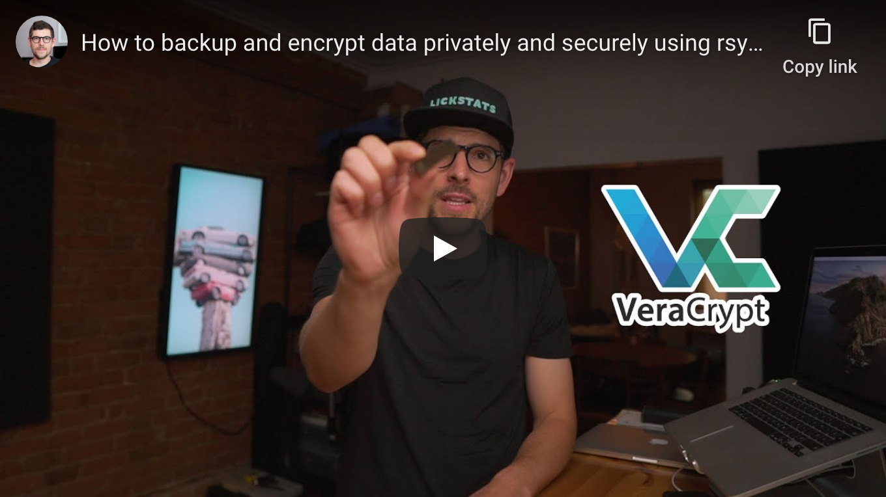

<!--
Title: How to backup and encrypt data privately and securely using rsync and VeraCrypt on macOS
Description: Learn how to backup and encrypt data privately and securely using rsync and VeraCrypt on macOS.
Author: Sun Knudsen <https://github.com/sunknudsen>
Contributors: Sun Knudsen <https://github.com/sunknudsen>
Publication date: 2020-08-26T14:07:36.767Z
-->

# How to backup and encrypt data privately and securely using rsync and VeraCrypt on macOS

[](https://www.youtube.com/watch?v=1cz_ViFB6eE "How to backup and encrypt data privately and securely using rsync and VeraCrypt on macOS - YouTube")

## Requirements

- Computer running macOS Mojave or Catalina

## Caveats

- When copy/pasting commands that start with `$`, strip out `$` as this character is not part of the command
- When copy/pasting commands that start with `cat << "EOF"`, select all lines at once (from `cat << "EOF"` to `EOF` inclusively) as they are part of the same (single) command

## Setup guide

### Step 1: download and install [FUSE](https://osxfuse.github.io/)

Go to https://osxfuse.github.io/, download and install latest release.

### Step 2: install [GnuPG](https://gnupg.org/)

Follow steps from [How to encrypt, sign and decrypt messages using PGP on macOS (adding privacy to email)](../how-to-encrypt-sign-and-decrypt-messages-using-pgp-on-macos-adding-privacy-to-email) guide.

### Step 3: import VeraCrypt’s public key

```console
$ gpg --keyserver hkps://keys.openpgp.org --recv-keys 0x821ACD02680D16DE
gpg: key 0x821ACD02680D16DE: public key "VeraCrypt Team (2018 - Supersedes Key ID=0x54DDD393) <veracrypt@idrix.fr>" imported
gpg: Total number processed: 1
gpg:               imported: 1
```

### Step 4: download [VeraCrypt](https://www.veracrypt.fr/en/Home.html)

Go to https://www.veracrypt.fr/en/Downloads.html and download latest release and its associated PGP signature to `~/Downloads` folder.

### Step 5: verify VeraCrypt release signature using GnuPG

Replace `VeraCrypt_1.24-Update7` with current release.

```console
$ gpg --verify ~/Downloads/VeraCrypt_1.24-Update7.dmg.sig
gpg: assuming signed data in '/Users/sunknudsen/Downloads/VeraCrypt_1.24-Update7.dmg'
gpg: Signature made Sat  8 Aug 14:20:27 2020 EDT
gpg:                using RSA key 5069A233D55A0EEB174A5FC3821ACD02680D16DE
gpg: Good signature from "VeraCrypt Team (2018 - Supersedes Key ID=0x54DDD393) <veracrypt@idrix.fr>" [unknown]
gpg: WARNING: This key is not certified with a trusted signature!
gpg:          There is no indication that the signature belongs to the owner.
Primary key fingerprint: 5069 A233 D55A 0EEB 174A  5FC3 821A CD02 680D 16DE
```

Good signature

👍

### Step 6: install VeraCrypt

### Step 7: create and test VeraCrypt symlink

```console
$ ln -s /Applications/VeraCrypt.app/Contents/MacOS/VeraCrypt /usr/local/bin/veracrypt

$ veracrypt --text --version
VeraCrypt 1.24-Update7
```

VeraCrypt 1.24-Update7

👍

### Step 8: set temporary environment variable

> Heads up: using `.b` as encrypted volume path to make things inconspicuous (files that start with `.` are hidden on macOS, use <kbd>cmd+shift+.</kbd> to display them).

`BACKUP_VOLUME_PATH` path to VeraCrypt volume

```shell
BACKUP_VOLUME_PATH="/Volumes/Samsung BAR/.b"
```

### Step 9: create encrypted volume

> Heads up: volume size cannot be increased later.

> Heads up: Mac OS Extended filesystem required on macOS.

```console
$ veracrypt --text --create "$BACKUP_VOLUME_PATH"
Volume type:
 1) Normal
 2) Hidden
Select [1]:

Enter volume size (sizeK/size[M]/sizeG): 1G

Encryption Algorithm:
 1) AES
 2) Serpent
 3) Twofish
 4) Camellia
 5) Kuznyechik
 6) AES(Twofish)
 7) AES(Twofish(Serpent))
 8) Camellia(Kuznyechik)
 9) Camellia(Serpent)
 10) Kuznyechik(AES)
 11) Kuznyechik(Serpent(Camellia))
 12) Kuznyechik(Twofish)
 13) Serpent(AES)
 14) Serpent(Twofish(AES))
 15) Twofish(Serpent)
Select [1]:

Hash algorithm:
 1) SHA-512
 2) Whirlpool
 3) SHA-256
 4) Streebog
Select [1]:

Filesystem:
 1) None
 2) FAT
 3) Mac OS Extended
 4) exFAT
 5) APFS
Select [3]:

Enter password:
Re-enter password:

Enter PIM:

Enter keyfile path [none]:

Please type at least 320 randomly chosen characters and then press Enter:


Done: 100.000%  Speed: 245 MiB/s  Left: 0 s

The VeraCrypt volume has been successfully created.
```

### Step 10 (optional): mount, rename and dismount encrypted volume

By default, VeraCrypt encrypted volumes are named "untitled".

#### Mount encrypted volume

```console
$ veracrypt --text --mount --pim 0 --keyfiles "" --protect-hidden no "$BACKUP_VOLUME_PATH" /Volumes/Backup
Enter password for /Volumes/SAMSUNG BAR/.b:
```

#### Rename encrypted volume

```console
$ diskutil rename "untitled" "Backup"
Volume on disk3 renamed to Backup
```

#### Dismount encrypted volume

```shell
veracrypt --text --dismount "$BACKUP_VOLUME_PATH"
```

### Step 11: create backup script

```shell
cat << EOF > /usr/local/bin/backup.sh
#! /bin/sh

set -e

red=$'\e[1;31m'
end=$'\e[0m'

veracrypt --text --mount --pim 0 --keyfiles "" --protect-hidden no "$BACKUP_VOLUME_PATH" /Volumes/Backup

declare -a files=(
  "/Users/$(whoami)/.gnupg"
  "/Users/$(whoami)/.ssh"
  "/Users/$(whoami)/Library/Keychains"
)

for file in "\${files[@]}"; do
  rsync -axRS --delete "\$file" /Volumes/Backup
done

open /Volumes/Backup

printf "\${red}Inspect backup and press enter\${end}"

read -r answer

veracrypt --text --dismount "$BACKUP_VOLUME_PATH"

echo "Done"
EOF
chmod +x /usr/local/bin/backup.sh
```

### Step 12: edit backup script

```shell
vi /usr/local/bin/backup.sh
```

Press <kbd>i</kbd> to enter insert mode, edit backup script, press <kbd>esc</kbd> to exit insert mode and press <kbd>shift+z+z</kbd> to save and exit.

## Usage guide

```console
$ backup.sh
Enter password for /Volumes/Samsung BAR/.b:
Inspect backup and press enter
Done
```

Done

👍
