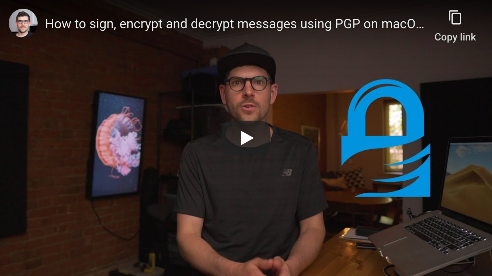

<!--
Title: How to encrypt, sign and decrypt messages using PGP on macOS (adding privacy to email)
Description: Learn how to encrypt, sign and decrypt messages using PGP on macOS (adding privacy to email).
Author: Sun Knudsen <https://github.com/sunknudsen>
Contributors: Sun Knudsen <https://github.com/sunknudsen>
Publication date: 2020-06-18T00:00:00.000Z
-->

# How to encrypt, sign and decrypt messages using PGP on macOS (adding privacy to email)

[](https://www.youtube.com/watch?v=mE8fL5Fu8x8 "How to sign, encrypt and decrypt messages using PGP on macOS (adding privacy to email) - YouTube")

> WARNING: this is a getting started guide. For a hardened guide, see https://github.com/drduh/YubiKey-Guide.

## Installation guide

#### Step 1: install [Homebrew](https://brew.sh/)

```shell
/bin/bash -c "$(curl -fsSL https://raw.githubusercontent.com/Homebrew/install/master/install.sh)"
```

#### Step 2: disable analytics

```shell
brew analytics off
```

#### Step 3: install [GnuPG](https://gnupg.org/)

```shell
brew install gnupg
```

#### Step 4: generate PGP key pair

```shell
$ gpg --full-generate-key
gpg (GnuPG) 2.2.20; Copyright (C) 2020 Free Software Foundation, Inc.
This is free software: you are free to change and redistribute it.
There is NO WARRANTY, to the extent permitted by law.

gpg: directory '/Users/johndoe/.gnupg' created
gpg: keybox '/Users/johndoe/.gnupg/pubring.kbx' created
Please select what kind of key you want:
   (1) RSA and RSA (default)
   (2) DSA and Elgamal
   (3) DSA (sign only)
   (4) RSA (sign only)
  (14) Existing key from card
Your selection? 1
RSA keys may be between 1024 and 4096 bits long.
What keysize do you want? (2048) 4096
Requested keysize is 4096 bits
Please specify how long the key should be valid.
         0 = key does not expire
      <n>  = key expires in n days
      <n>w = key expires in n weeks
      <n>m = key expires in n months
      <n>y = key expires in n years
Key is valid for? (0) 0
Key does not expire at all
Is this correct? (y/N) y

GnuPG needs to construct a user ID to identify your key.

Real name: John Doe
Email address: john@example.net
Comment:
You selected this USER-ID:
    "John Doe <john@example.net>"

Change (N)ame, (C)omment, (E)mail or (O)kay/(Q)uit? O
We need to generate a lot of random bytes. It is a good idea to perform
some other action (type on the keyboard, move the mouse, utilize the
disks) during the prime generation; this gives the random number
generator a better chance to gain enough entropy.
We need to generate a lot of random bytes. It is a good idea to perform
some other action (type on the keyboard, move the mouse, utilize the
disks) during the prime generation; this gives the random number
generator a better chance to gain enough entropy.
gpg: /Users/johndoe/.gnupg/trustdb.gpg: trustdb created
gpg: key 1BDC94DFB97BE4D4 marked as ultimately trusted
gpg: directory '/Users/johndoe/.gnupg/openpgp-revocs.d' created
gpg: revocation certificate stored as '/Users/johndoe/.gnupg/openpgp-revocs.d/F365EDCF06F4D9F09BB7D4EB1BDC94DFB97BE4D4.rev'
public and secret key created and signed.

pub   rsa4096 2020-06-16 [SC]
      F365EDCF06F4D9F09BB7D4EB1BDC94DFB97BE4D4
uid                      John Doe <john@example.net>
sub   rsa4096 2020-06-16 [E]
```

#### Step 5: set default PGP key server to `hkps://keys.openpgp.org`

```shell
echo "keyserver hkps://keys.openpgp.org" >> ~/.gnupg/dirmngr.conf
```

---

## Usage guide

#### Export John’s PGP public key

```shell
gpg --armor --export john@example.net > ~/Desktop/john.asc
```

#### Import Sun’s PGP public key

```shell
gpg --keyserver hkps://keys.openpgp.org --recv-keys 0xC1323A377DE14C8B
```

or

```shell
curl https://sunknudsen.com/sunknudsen.asc | gpg --import
```

#### Confirm Sun’s PGP public key is legit using its fingerprint

```shell
$ gpg --fingerprint hello@sunknudsen.com
gpg: checking the trustdb
gpg: marginals needed: 3  completes needed: 1  trust model: pgp
gpg: depth: 0  valid:   1  signed:   0  trust: 0-, 0q, 0n, 0m, 0f, 1u
pub   rsa4096 2019-10-17 [C]
      C4FB DDC1 6A26 2672 920D  0A0F C132 3A37 7DE1 4C8B
uid           [ unknown] Sun Knudsen <hello@sunknudsen.com>
sub   rsa4096 2019-10-17 [A] [expires: 2020-10-16]
sub   rsa4096 2019-10-17 [E] [expires: 2020-10-16]
sub   rsa4096 2019-10-17 [S] [expires: 2020-10-16]
```

See https://sunknudsen.com/, https://github.com/sunknudsen/pgp-public-key and https://www.youtube.com/sunknudsen/about and make sure fingerprint `C4FB DDC1 6A26 2672 920D 0A0F C132 3A37 7DE1 4C8B` matches the one published.

👍

#### Paste, encrypt and sign message (enter line break and use command `ctrl+d` to quit edit mode)

```shell
$ gpg --encrypt --sign --armor --output ~/Desktop/encrypted.asc -r john@example.net -r hello@sunknudsen.com
gpg: 5574F4B0B0F67D7F: There is no assurance this key belongs to the named user

sub  rsa4096/5574F4B0B0F67D7F 2019-10-17 Sun Knudsen <hello@sunknudsen.com>
 Primary key fingerprint: C4FB DDC1 6A26 2672 920D  0A0F C132 3A37 7DE1 4C8B
      Subkey fingerprint: 35A2 7551 E77C 3ED9 8527  032A 5574 F4B0 B0F6 7D7F

It is NOT certain that the key belongs to the person named
in the user ID.  If you *really* know what you are doing,
you may answer the next question with yes.

Use this key anyway? (y/N) y
This is a test!
```

#### Decrypt message to stdout and decode quoted-printable characters

```‌shell
$ gpg --decrypt /Users/johndoe/Desktop/encrypted.asc | perl -MMIME::QuotedPrint -0777 -nle 'print decode_qp($_)'
gpg: encrypted with 4096-bit RSA key, ID 5574F4B0B0F67D7F, created 2019-10-17
      "Sun Knudsen <hello@sunknudsen.com>"
gpg: encrypted with 4096-bit RSA key, ID 0DA22A1AC7DBA3F9, created 2020-06-16
      "John Doe <john@example.net>"
gpg: Signature made Thu 18 Jun 10:45:04 2020 EDT
gpg:                using RSA key F365EDCF06F4D9F09BB7D4EB1BDC94DFB97BE4D4
gpg: Good signature from "John Doe <john@example.net>" [ultimate]
This is a test!
```

#### Clear passphrase from GnuPG cache

```shell
gpg-connect-agent reloadagent /bye
```
